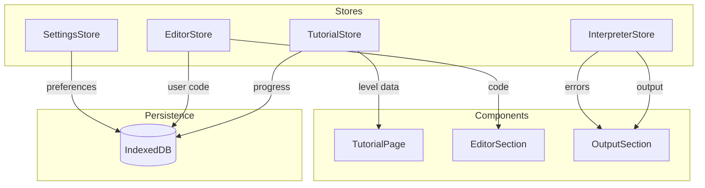
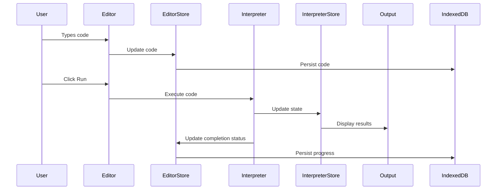
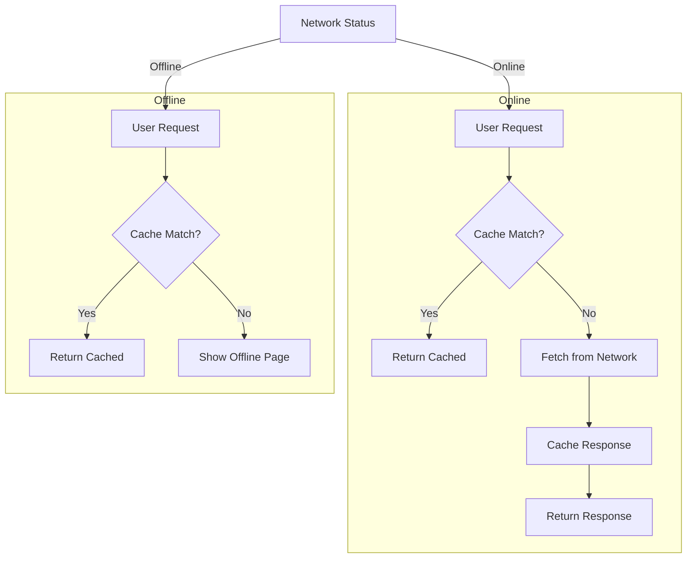
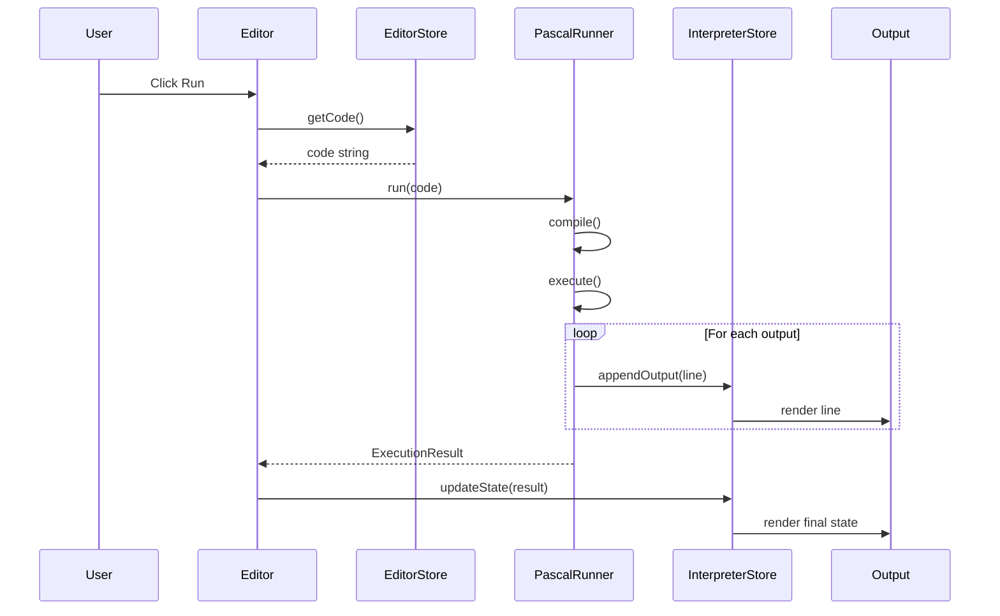
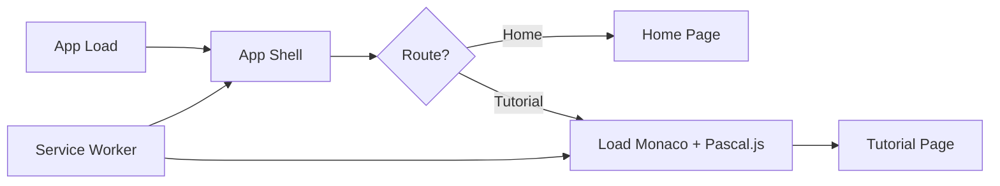

# In Memoriam Pascal - System Architecture

| Field | Value |
|-------|-------|
| **Title** | In Memoriam Pascal - System Architecture |
| **Version** | 1.0.0 |
| **Status** | Draft |
| **Created** | 2026-02-24 |
| **Author** | GLM-5 Architect |

---

## Executive Summary

This document defines the system architecture for "In Memoriam Pascal", a web application that teaches Pascal programming through interactive tutorials. The application runs entirely client-side, featuring a retro 80s aesthetic, Monaco Editor for code editing, and Pascal.js for in-browser code execution.

**Key Points**:

- **React 19 + TypeScript** with Vite for optimal DX and bundle size
- **Zustand** for state management with IndexedDB persistence
- **Monaco Editor** with custom Pascal language support
- **Pascal.js** interpreter for client-side code execution
- **PWA** with service worker for offline capability
- **react-i18next** for German localization with gender-sensitive language

---

## Table of Contents

1. [Technology Stack Selection](#1-technology-stack-selection)
2. [Component Architecture](#2-component-architecture)
3. [File Structure](#3-file-structure)
4. [Data Models](#4-data-models)
5. [PWA Architecture](#5-pwa-architecture)
6. [Localization Strategy](#6-localization-strategy)
7. [Integration Points](#7-integration-points)
8. [Security Considerations](#8-security-considerations)
9. [Performance Strategy](#9-performance-strategy)
10. [References](#references)

---

## 1. Technology Stack Selection

### 1.1 Frontend Framework: React 19 + TypeScript

**Decision**: React 19 with TypeScript 5.6+

**Rationale**:

| Factor | React 19 | Vue 3 | Svelte | Vanilla |
|--------|----------|-------|--------|---------|
| Monaco integration | Excellent | Good | Good | Manual |
| TypeScript support | Native | Native | Native | Manual |
| Bundle size | Medium | Small | Smallest | Smallest |
| PWA ecosystem | Excellent | Good | Good | Manual |
| i18n libraries | react-i18next | vue-i18n | svelte-i18n | Manual |
| Testing ecosystem | Excellent | Good | Good | Manual |
| Team familiarity | High | Medium | Low | N/A |

**Key React 19 Features Used**:

- Actions for form handling (`useActionState`, `useFormStatus`)
- `use()` hook for reading context in render
- Automatic memoization via React Compiler
- Suspense for code splitting

### 1.2 Build Tooling: Vite

**Decision**: Vite 6.x with React plugin

**Rationale**:

| Factor | Vite | Webpack | esbuild |
|--------|------|---------|---------|
| Dev server startup | ~300ms | ~3s | ~100ms |
| Hot Module Replacement | Fast | Medium | Fast |
| Configuration | Minimal | Complex | Manual |
| PWA plugin | vite-plugin-pwa | workbox-webpack | Manual |
| Tree shaking | Excellent | Good | Excellent |

**Vite Configuration Highlights**:

```typescript
// vite.config.ts structure
{
  plugins: [
    react(),
    VitePWA({ /* PWA config */ }),
    MonacoEditorPlugin()
  ],
  build: {
    target: 'esnext',
    rollupOptions: {
      output: {
        manualChunks: {
          'monaco-editor': ['monaco-editor'],
          'pascal-interpreter': ['pascal.js'],
          'vendor-react': ['react', 'react-dom']
        }
      }
    }
  }
}
```

### 1.3 CSS Approach: Tailwind CSS + Custom Retro Theme

**Decision**: Tailwind CSS 4.x with custom design tokens

**Rationale**:

| Factor | Tailwind | SCSS | CSS Modules | Styled Components |
|--------|----------|------|-------------|-------------------|
| Bundle size | Purged | Full | Full | Full + runtime |
| Retro theming | Design tokens | Variables | Variables | Theme provider |
| Responsive | Built-in | Manual | Manual | Manual |
| Dark mode | Built-in | Manual | Manual | Manual |
| Accessibility | Utilities | Manual | Manual | Manual |

**Retro Theme Design Tokens**:

```css
:root {
  /* CRT-inspired colors */
  --retro-amber: #FFB000;
  --retro-green: #33FF33;
  --retro-cyan: #00FFFF;
  --retro-magenta: #FF00FF;
  
  /* Terminal backgrounds */
  --terminal-bg: #0D0D0D;
  --terminal-text: #33FF33;
  
  /* Scanline effect */
  --scanline-opacity: 0.1;
}
```

### 1.4 State Management: Zustand

**Decision**: Zustand with persist middleware

**Rationale**:

| Factor | Zustand | Redux Toolkit | Context API | Jotai |
|--------|---------|---------------|-------------|-------|
| Boilerplate | Minimal | Medium | Minimal | Minimal |
| Bundle size | ~1KB | ~11KB | 0 | ~3KB |
| Persistence | Built-in | Extra | Manual | Built-in |
| DevTools | Good | Excellent | Manual | Good |
| Learning curve | Low | Medium | Low | Medium |

**State Slices**:

- `useTutorialStore` - Tutorial progress and navigation
- `useEditorStore` - Code content and editor state
- `useInterpreterStore` - Execution state and output
- `useSettingsStore` - User preferences

### 1.5 Additional Libraries

| Purpose | Library | Bundle Impact |
|---------|---------|---------------|
| Code Editor | monaco-editor | ~500KB (lazy) |
| Pascal Interpreter | pascal.js | ~200KB |
| i18n | react-i18next | ~15KB |
| IndexedDB | idb | ~3KB |
| Router | react-router-dom | ~12KB |
| Icons | lucide-react | Tree-shaken |
| Animations | framer-motion | ~25KB |

---

## 2. Component Architecture

### 2.1 High-Level Component Hierarchy

```
App
├── ErrorBoundary
├── I18nProvider
├── SettingsProvider
└── Router
    ├── Layout
    │   ├── Header
    │   │   ├── Logo
    │   │   ├── Navigation
    │   │   └── SettingsMenu
    │   ├── SkipLink (a11y)
    │   └── Main
    │       └── <Outlet />
    ├── HomePage
    │   ├── HeroSection
    │   ├── Introduction
    │   └── LevelGrid
    ├── TutorialPage
    │   ├── TutorialHeader
    │   │   ├── LevelTitle
    │   │   └── ProgressIndicator
    │   ├── ContentSection
    │   │   ├── ConceptExplanation
    │   │   └── CodeExamples
    │   ├── EditorSection
    │   │   ├── MonacoEditor
    │   │   ├── EditorToolbar
    │   │   └── HintPanel
    │   ├── OutputSection
    │   │   ├── OutputDisplay
    │   │   └── ErrorDisplay
    │   └── NavigationControls
    │       ├── PreviousButton
    │       ├── RunButton
    │       └── NextButton
    └── NotFoundPage
```

### 2.2 Component Categories

#### Smart Components (Container)

- `TutorialPage` - Orchestrates tutorial state
- `EditorSection` - Manages editor and interpreter
- `SettingsProvider` - Global settings state

#### Dumb Components (Presentational)

- `LevelCard` - Displays level preview
- `CodeBlock` - Syntax-highlighted code display
- `OutputLine` - Single output line
- `ProgressBar` - Visual progress indicator

#### Layout Components

- `Layout` - Main page structure
- `Header` - Navigation and branding
- `Sidebar` - Level navigation (optional)

### 2.3 State Management Architecture



### 2.4 Data Flow



---

## 3. File Structure

```
in-memoriam-pascal/
├── .github/
│   └── workflows/
│       ├── ci.yml
│       └── deploy.yml
├── .kilocode/
│   ├── outputs/
│   └── project-state.md
├── public/
│   ├── favicon.ico
│   ├── manifest.json
│   ├── robots.txt
│   └── icons/
│       ├── icon-192.png
│       ├── icon-512.png
│       └── maskable-icon.png
├── src/
│   ├── assets/
│   │   ├── fonts/
│   │   │   ├── VT323.woff2
│   │   │   └── ShareTechMono.woff2
│   │   └── images/
│   │       ├── pascal-portrait.webp
│   │       └── retro-patterns/
│   ├── components/
│   │   ├── common/
│   │   │   ├── Button/
│   │   │   │   ├── Button.tsx
│   │   │   │   ├── Button.test.tsx
│   │   │   │   └── index.ts
│   │   │   ├── Card/
│   │   │   ├── Modal/
│   │   │   ├── ProgressBar/
│   │   │   └── SkipLink/
│   │   ├── editor/
│   │   │   ├── MonacoEditor/
│   │   │   │   ├── MonacoEditor.tsx
│   │   │   │   ├── MonacoEditor.test.tsx
│   │   │   │   ├── useMonacoSetup.ts
│   │   │   │   └── index.ts
│   │   │   ├── EditorToolbar/
│   │   │   ├── HintPanel/
│   │   │   └── OutputDisplay/
│   │   ├── layout/
│   │   │   ├── Header/
│   │   │   ├── Footer/
│   │   │   ├── Layout/
│   │   │   └── Navigation/
│   │   └── tutorial/
│   │       ├── LevelCard/
│   │       ├── LevelGrid/
│   │       ├── TutorialHeader/
│   │       ├── ConceptExplanation/
│   │       └── NavigationControls/
│   ├── data/
│   │   └── tutorials/
│   │       ├── index.ts
│   │       ├── level-01-hello-world.ts
│   │       ├── level-02-variables.ts
│   │       ├── level-03-data-types.ts
│   │       └── ... (10 levels)
│   ├── hooks/
│   │   ├── useIndexedDB.ts
│   │   ├── useInterpreter.ts
│   │   ├── useLocalStorage.ts
│   │   └── useTutorialProgress.ts
│   ├── i18n/
│   │   ├── index.ts
│   │   └── locales/
│   │       └── de/
│   │           ├── common.json
│   │           ├── tutorials.json
│   │           ├── levels.json
│   │           └── errors.json
│   ├── lib/
│   │   ├── interpreter/
│   │   │   ├── pascalRunner.ts
│   │   │   ├── outputCapture.ts
│   │   │   └── errorParser.ts
│   │   ├── storage/
│   │   │   ├── indexedDB.ts
│   │   │   └── migrations.ts
│   │   └── utils/
│   │       ├── cn.ts
│   │       └── formatDate.ts
│   ├── pages/
│   │   ├── HomePage/
│   │   │   ├── HomePage.tsx
│   │   │   ├── HomePage.test.tsx
│   │   │   └── index.ts
│   │   ├── TutorialPage/
│   │   │   ├── TutorialPage.tsx
│   │   │   ├── TutorialPage.test.tsx
│   │   │   └── index.ts
│   │   └── NotFoundPage/
│   ├── stores/
│   │   ├── tutorialStore.ts
│   │   ├── editorStore.ts
│   │   ├── interpreterStore.ts
│   │   └── settingsStore.ts
│   ├── styles/
│   │   ├── globals.css
│   │   ├── retro-theme.css
│   │   └── animations.css
│   ├── types/
│   │   ├── tutorial.ts
│   │   ├── progress.ts
│   │   ├── interpreter.ts
│   │   └── i18n.d.ts
│   ├── App.tsx
│   ├── main.tsx
│   └── vite-env.d.ts
├── tests/
│   ├── e2e/
│   │   ├── tutorial-flow.spec.ts
│   │   └── offline.spec.ts
│   └── setup.ts
├── .gitignore
├── index.html
├── package.json
├── postcss.config.js
├── tailwind.config.js
├── tsconfig.json
├── vite.config.ts
└── vitest.config.ts
```

---

## 4. Data Models

### 4.1 Tutorial Level Schema

```typescript
// types/tutorial.ts

interface TutorialLevel {
  /** Unique identifier for the level */
  id: string;
  
  /** Level number for ordering */
  number: number;
  
  /** Difficulty track classification */
  track: 'basic' | 'beginner' | 'intermediate' | 'advanced';
  
  /** i18n key for level title */
  titleKey: string;
  
  /** i18n key for level description */
  descriptionKey: string;
  
  /** Learning objectives (i18n keys) */
  objectives: string[];
  
  /** Concept explanations with i18n keys */
  concepts: ConceptExplanation[];
  
  /** Code examples */
  examples: CodeExample[];
  
  /** Initial code template shown in editor */
  starterCode: string;
  
  /** Expected output for validation */
  expectedOutput?: string;
  
  /** Validation rules */
  validation: ValidationRule[];
  
  /** Available hints */
  hints: Hint[];
  
  /** Estimated completion time in minutes */
  estimatedTime: number;
  
  /** Prerequisites (level IDs) */
  prerequisites: string[];
}

interface ConceptExplanation {
  /** i18n key for concept title */
  titleKey: string;
  
  /** i18n key for concept content */
  contentKey: string;
  
  /** Optional code illustration */
  codeExample?: string;
}

interface CodeExample {
  /** Pascal code snippet */
  code: string;
  
  /** i18n key for explanation */
  explanationKey: string;
  
  /** Whether code is editable */
  editable: boolean;
}

interface ValidationRule {
  type: 'output_match' | 'contains_keyword' | 'compiles' | 'custom';
  
  /** Rule-specific configuration */
  config: Record<string, unknown>;
  
  /** i18n key for error message */
  errorKey: string;
}

interface Hint {
  /** Hint level (1 = gentle, 3 = explicit) */
  level: 1 | 2 | 3;
  
  /** i18n key for hint content */
  contentKey: string;
  
  /** Points cost for using this hint */
  cost: number;
}
```

### 4.2 User Progress Schema

```typescript
// types/progress.ts

interface UserProgress {
  /** Unique user ID (generated locally) */
  userId: string;
  
  /** Creation timestamp */
  createdAt: string;
  
  /** Last activity timestamp */
  lastActiveAt: string;
  
  /** Per-level progress */
  levels: Record<string, LevelProgress>;
  
  /** Overall statistics */
  statistics: ProgressStatistics;
  
  /** User settings */
  settings: UserSettings;
}

interface LevelProgress {
  /** Level ID */
  levelId: string;
  
  /** Completion status */
  status: 'not_started' | 'in_progress' | 'completed';
  
  /** User's saved code */
  savedCode: string;
  
  /** Number of attempts */
  attempts: number;
  
  /** Hints used */
  hintsUsed: number[];
  
  /** Best execution time (ms) */
  bestExecutionTime?: number;
  
  /** First completion timestamp */
  completedAt?: string;
  
  /** Last attempt timestamp */
  lastAttemptAt: string;
}

interface ProgressStatistics {
  /** Total levels completed */
  completedLevels: number;
  
  /** Total code executions */
  totalExecutions: number;
  
  /** Total time spent (minutes) */
  totalTimeSpent: number;
  
  /** Current streak (days) */
  currentStreak: number;
  
  /** Longest streak (days) */
  longestStreak: number;
}

interface UserSettings {
  /** Editor font size */
  fontSize: number;
  
  /** Editor theme */
  theme: 'retro-green' | 'retro-amber' | 'retro-cyan';
  
  /** Sound effects enabled */
  soundEnabled: boolean;
  
  /** Reduced motion preference */
  reducedMotion: boolean;
  
  /** Language preference */
  language: 'de';
}
```

### 4.3 IndexedDB Structure

```typescript
// lib/storage/indexedDB.ts

interface DBSchema {
  /** User progress data */
  progress: {
    key: string; // userId
    value: UserProgress;
    indexes: {
      'by-lastActive': string; // lastActiveAt
    };
  };
  
  /** Saved code snapshots */
  codeSnapshots: {
    key: [string, string]; // [levelId, timestamp]
    value: {
      levelId: string;
      timestamp: string;
      code: string;
      output?: string;
    };
    indexes: {
      'by-level': string;
    };
  };
  
  /** Tutorial content cache */
  tutorials: {
    key: string; // levelId
    value: TutorialLevel;
  };
  
  /** Application state */
  appState: {
    key: string;
    value: unknown;
  };
}

const DB_CONFIG = {
  name: 'in-memoriam-pascal',
  version: 1,
  stores: ['progress', 'codeSnapshots', 'tutorials', 'appState']
};
```

### 4.4 Hint System Schema

```typescript
// types/hint.ts

interface HintState {
  /** Current level ID */
  levelId: string;
  
  /** Hints already revealed */
  revealedHints: number[];
  
  /** Total hint points available */
  totalPoints: number;
  
  /** Points remaining */
  remainingPoints: number;
}

interface HintConfig {
  /** Points awarded per level completion */
  completionBonus: number;
  
  /** Points per hint level */
  hintCosts: {
    1: 5;  // Gentle hint
    2: 10; // Moderate hint
    3: 20; // Explicit hint
  };
}
```

---

## 5. PWA Architecture

### 5.1 Service Worker Strategy

```typescript
// vite.config.ts - PWA plugin configuration

const pwaConfig = {
  strategies: 'injectManifest',
  srcDir: 'src',
  filename: 'sw.ts',
  
  // Runtime caching strategies
  runtimeCaching: [
    {
      // Monaco Editor chunks
      urlPattern: /monaco-editor/,
      handler: 'CacheFirst',
      options: {
        cacheName: 'monaco-cache',
        expiration: {
          maxEntries: 10,
          maxAgeSeconds: 60 * 60 * 24 * 30 // 30 days
        }
      }
    },
    {
      // Pascal.js interpreter
      urlPattern: /pascal\.js/,
      handler: 'CacheFirst',
      options: {
        cacheName: 'interpreter-cache',
        expiration: {
          maxEntries: 5,
          maxAgeSeconds: 60 * 60 * 24 * 30
        }
      }
    },
    {
      // Static assets
      urlPattern: /\.(png|jpg|svg|woff2?)/,
      handler: 'CacheFirst',
      options: {
        cacheName: 'assets-cache',
        expiration: {
          maxEntries: 50,
          maxAgeSeconds: 60 * 60 * 24 * 365
        }
      }
    }
  ]
};
```

### 5.2 Offline Capabilities



### 5.3 Cache Strategy Details

| Resource Type | Strategy | Rationale |
|---------------|----------|-----------|
| App Shell | Precache | Core UI must work offline |
| Monaco Editor | Cache First | Large, rarely changes |
| Pascal.js | Cache First | Interpreter rarely changes |
| Tutorial Data | Network First | Updates possible |
| User Code | IndexedDB | Persistent storage |
| Fonts | Cache First | Static assets |

### 5.4 Manifest Configuration

```json
{
  "name": "In Memoriam Pascal",
  "short_name": "Pascal Tutorial",
  "description": "Lerne Pascal programmieren mit interaktiven Tutorials",
  "start_url": "/",
  "display": "standalone",
  "background_color": "#0D0D0D",
  "theme_color": "#33FF33",
  "orientation": "any",
  "icons": [
    {
      "src": "/icons/icon-192.png",
      "sizes": "192x192",
      "type": "image/png"
    },
    {
      "src": "/icons/icon-512.png",
      "sizes": "512x512",
      "type": "image/png"
    },
    {
      "src": "/icons/maskable-icon.png",
      "sizes": "512x512",
      "type": "image/png",
      "purpose": "maskable"
    }
  ],
  "categories": ["education", "productivity"],
  "lang": "de"
}
```

---

## 6. Localization Strategy

### 6.1 i18n Architecture

**Library**: react-i18next

**Rationale**:

- Mature ecosystem with excellent React integration
- Supports gender-sensitive language via interpolation
- Lazy loading of translation files
- Pluralization support
- Namespace organization

### 6.2 String Organization

```
src/i18n/locales/de/
├── common.json       # UI elements, buttons, navigation
├── tutorials.json    # Tutorial UI strings
├── levels.json       # Level-specific content
├── errors.json       # Error messages
├── hints.json        # Hint content
└── accessibility.json # A11y labels
```

### 6.3 Gender-Sensitive Language Pattern

```json
// levels.json
{
  "level-01": {
    "title": "Hallo Welt!",
    "description": "In diesem Level lernst du, dein erstes Pascal-Programm zu schreiben.",
    "learner_greeting": "Willkommen, {{gender, select, male{Lieber Lernender} female{Liebe Lernende} other{Liebe*r Lernende*r}}!"
  }
}
```

```typescript
// Usage in component
const { t } = useTranslation('levels');

<span>
  {t('level-01.learner_greeting', { 
    gender: userSettings.gender 
  })}
</span>
```

### 6.4 Translation Key Structure

```typescript
// i18n/index.ts

const i18nConfig = {
  supportedLngs: ['de'],
  fallbackLng: 'de',
  defaultNS: 'common',
  ns: ['common', 'tutorials', 'levels', 'errors', 'hints', 'accessibility'],
  
  interpolation: {
    escapeValue: false, // React escapes by default
    format: (value, format, lng) => {
      if (format === 'gender') {
        return applyGenderForm(value, lng);
      }
      return value;
    }
  },
  
  react: {
    useSuspense: true
  }
};
```

### 6.5 Accessibility Labels

```json
// accessibility.json
{
  "skip_to_content": "Zum Hauptinhalt springen",
  "main_navigation": "Hauptnavigation",
  "level_navigation": "Level-Navigation",
  "code_editor": "Code-Editor",
  "run_code": "Code ausführen",
  "output_area": "Ausgabebereich",
  "hint_available": "Hinweis verfügbar",
  "level_complete": "Level abgeschlossen"
}
```

---

## 7. Integration Points

### 7.1 Monaco Editor Integration

```typescript
// components/editor/MonacoEditor/useMonacoSetup.ts

interface MonacoSetupOptions {
  theme: 'retro-green' | 'retro-amber' | 'retro-cyan';
  fontSize: number;
  readOnly: boolean;
}

function useMonacoSetup(options: MonacoSetupOptions) {
  useEffect(() => {
    // Register Pascal language
    monaco.languages.register({ id: 'pascal' });
    
    // Define Pascal syntax highlighting
    monaco.languages.setMonarchTokensProvider('pascal', pascalLanguageDefinition);
    
    // Register completion provider
    monaco.languages.registerCompletionItemProvider('pascal', {
      provideCompletionItems: providePascalCompletions
    });
    
    // Define custom theme
    monaco.editor.defineTheme('retro-green', retroGreenTheme);
    monaco.editor.defineTheme('retro-amber', retroAmberTheme);
    monaco.editor.defineTheme('retro-cyan', retroCyanTheme);
    
    // Set active theme
    monaco.editor.setTheme(options.theme);
  }, [options.theme]);
}

// Pascal language definition (Turbo Pascal dialect)
const pascalLanguageDefinition: monaco.languages.IMonarchLanguage = {
  keywords: [
    'program', 'begin', 'end', 'var', 'const', 'type',
    'procedure', 'function', 'if', 'then', 'else',
    'while', 'do', 'for', 'to', 'downto', 'repeat',
    'until', 'case', 'of', 'record', 'array', 'string',
    'integer', 'real', 'boolean', 'char', 'uses', 'unit'
  ],
  
  operators: [
    ':=', '=', '<>', '<', '>', '<=', '>=', '+', '-', '*', '/', 'div', 'mod', 'and', 'or', 'not'
  ],
  
  symbols: /[=><!:]+/,
  
  tokenizer: {
    root: [
      [/[a-zA-Z_][a-zA-Z0-9_]*/, { cases: { '@keywords': 'keyword', '@default': 'identifier' } }],
      [/\d+/, 'number'],
      [/'[^']*'/, 'string'],
      [/\{[^}]*\}/, 'comment'],
      [/\(\*[\s\S]*?\*\)/, 'comment'],
      [/\/\/.*$/, 'comment']
    ]
  }
};
```

### 7.2 Pascal.js Interpreter Integration

```typescript
// lib/interpreter/pascalRunner.ts

interface ExecutionResult {
  success: boolean;
  output: string;
  errors: CompileError[];
  executionTime: number;
}

interface CompileError {
  line: number;
  column: number;
  message: string;
  severity: 'error' | 'warning';
}

class PascalRunner {
  private interpreter: PascalJS | null = null;
  private outputBuffer: string[] = [];
  
  async initialize(): Promise<void> {
    // Load Pascal.js dynamically
    const PascalJS = await import('pascal.js');
    this.interpreter = new PascalJS();
    
    // Configure output capture
    this.interpreter.setOutputHandler((text: string) => {
      this.outputBuffer.push(text);
    });
  }
  
  async run(code: string): Promise<ExecutionResult> {
    if (!this.interpreter) {
      await this.initialize();
    }
    
    this.outputBuffer = [];
    const startTime = performance.now();
    
    try {
      const result = await this.interpreter.compileAndRun(code);
      
      return {
        success: true,
        output: this.outputBuffer.join('\n'),
        errors: [],
        executionTime: performance.now() - startTime
      };
    } catch (error) {
      return {
        success: false,
        output: this.outputBuffer.join('\n'),
        errors: this.parseErrors(error),
        executionTime: performance.now() - startTime
      };
    }
  }
  
  private parseErrors(error: unknown): CompileError[] {
    // Parse Pascal.js error format
    // Map to structured error objects
  }
}
```

### 7.3 Output Capture Mechanism

```typescript
// lib/interpreter/outputCapture.ts

interface OutputCapture {
  stdout: string[];
  stderr: string[];
  clear(): void;
  getOutput(): string;
}

function createOutputCapture(): OutputCapture {
  const stdout: string[] = [];
  const stderr: string[] = [];
  
  return {
    stdout,
    stderr,
    clear() {
      stdout.length = 0;
      stderr.length = 0;
    },
    getOutput() {
      return stdout.join('\n');
    }
  };
}

// Integration with Pascal.js
function configureInterpreterOutput(
  interpreter: PascalJS, 
  capture: OutputCapture
): void {
  interpreter.setOutputHandler((text: string) => {
    capture.stdout.push(text);
  });
  
  interpreter.setErrorHandler((text: string) => {
    capture.stderr.push(text);
  });
}
```

### 7.4 Editor-Interpreter Communication



---

## 8. Security Considerations

### 8.1 Content Security Policy

```
Content-Security-Policy: 
  default-src 'self';
  script-src 'self' 'wasm-unsafe-eval';
  style-src 'self' 'unsafe-inline';
  font-src 'self' data:;
  img-src 'self' data:;
  connect-src 'self';
```

**Note**: `wasm-unsafe-eval` required for Pascal.js WebAssembly execution.

### 8.2 Code Execution Sandbox

- Pascal.js runs in WebAssembly sandbox
- No file system access
- No network access
- Memory limits enforced by browser

### 8.3 Input Validation

```typescript
// All user code is validated before execution
function validateCode(code: string): ValidationResult {
  // Check for potentially harmful patterns
  const forbiddenPatterns = [
    /external/i,  // External function calls
    /asm/i,       // Inline assembly
    /absolute/i   // Absolute memory addressing
  ];
  
  for (const pattern of forbiddenPatterns) {
    if (pattern.test(code)) {
      return { valid: false, reason: 'forbidden_construct' };
    }
  }
  
  return { valid: true };
}
```

---

## 9. Performance Strategy

### 9.1 Bundle Size Targets

| Chunk | Target Size | Strategy |
|-------|-------------|----------|
| App Shell | <100KB | Core React + routing |
| Monaco Editor | ~500KB | Lazy load on tutorial page |
| Pascal.js | ~200KB | Lazy load with Monaco |
| Tutorial Data | <50KB | Inline or lazy load |
| **Total Initial** | **<200KB** | gzipped |

### 9.2 Loading Strategy



### 9.3 Optimization Techniques

1. **Code Splitting**:

   ```typescript
   const TutorialPage = lazy(() => import('./pages/TutorialPage'));
   const MonacoEditor = lazy(() => import('./components/editor/MonacoEditor'));
   ```

2. **Font Loading**:

   ```css
   @font-face {
     font-family: 'VT323';
     font-display: swap; /* Prevent FOIT */
     src: url('/fonts/VT323.woff2') format('woff2');
   }
   ```

3. **Image Optimization**:
   - WebP format with AVIF fallback
   - Responsive images with `srcset`
   - Lazy loading for below-fold images

4. **Monaco Editor Optimization**:

   ```typescript
   // Load only required features
   import { editor } from 'monaco-editor/esm/vs/editor/editor.api';
   import 'monaco-editor/esm/vs/basic-languages/pascal/pascal';
   ```

### 9.4 Core Web Vitals Targets

| Metric | Target | Strategy |
|--------|--------|----------|
| LCP | <2.5s | Preload fonts, optimize images |
| INP | <200ms | Debounce editor updates, web worker for interpreter |
| CLS | <0.1 | Reserve space for editor, skeleton loading |

---

## References

| # | Reference | Link/Location |
|---|-----------|---------------|
| 1 | Pascal.js Repository | <https://github.com/kanaka/pascal.js/> |
| 2 | Monaco Editor Documentation | <https://microsoft.github.io/monaco-editor/> |
| 3 | Free Pascal Documentation | <https://www.freepascal.org/docs-html/user/user.html> |
| 4 | React 19 Documentation | <https://react.dev/> |
| 5 | Vite PWA Plugin | <https://vite-pwa-org.netlify.app/> |
| 6 | react-i18next | <https://react.i18next.com/> |
| 7 | Zustand | <https://zustand-demo.pmnd.rs/> |
| 8 | WCAG 2.1 AA Guidelines | <https://www.w3.org/WAI/WCAG21/quickref/> |

---

## Appendix

### Appendix A: Retro Theme CSS Variables

```css
:root {
  /* Color Palette - CRT Inspired */
  --retro-amber: #FFB000;
  --retro-green: #33FF33;
  --retro-cyan: #00FFFF;
  --retro-magenta: #FF00FF;
  --retro-white: #FFFFFF;
  
  /* Background Colors */
  --bg-primary: #0D0D0D;
  --bg-secondary: #1A1A1A;
  --bg-tertiary: #262626;
  
  /* Text Colors */
  --text-primary: #33FF33;
  --text-secondary: #66FF66;
  --text-muted: #4D4D4D;
  
  /* CRT Effects */
  --scanline-opacity: 0.1;
  --glow-spread: 2px;
  --glow-color: var(--text-primary);
  
  /* Typography */
  --font-mono: 'VT323', 'Share Tech Mono', monospace;
  --font-sans: 'IBM Plex Sans', system-ui, sans-serif;
  
  /* Spacing */
  --space-xs: 0.25rem;
  --space-sm: 0.5rem;
  --space-md: 1rem;
  --space-lg: 2rem;
  --space-xl: 4rem;
  
  /* Border Radius */
  --radius-sm: 2px;
  --radius-md: 4px;
  --radius-lg: 8px;
}
```

### Appendix B: IndexedDB Migration Strategy

```typescript
// lib/storage/migrations.ts

const migrations = {
  1: async (db: IDBDatabase) => {
    // Initial schema
    db.createObjectStore('progress', { keyPath: 'userId' });
    db.createObjectStore('codeSnapshots', { keyPath: ['levelId', 'timestamp'] });
    db.createObjectStore('tutorials', { keyPath: 'levelId' });
    db.createObjectStore('appState', { keyPath: 'key' });
  },
  
  2: async (db: IDBDatabase) => {
    // Future migration example
    const store = db.transaction('progress', 'readwrite').objectStore('progress');
    // Add new indexes or modify schema
  }
};

async function runMigrations(
  db: IDBDatabase, 
  oldVersion: number, 
  newVersion: number
): Promise<void> {
  for (let v = oldVersion + 1; v <= newVersion; v++) {
    await migrations[v](db);
  }
}
```

---

## Document Control

| Version | Date | Author | Changes |
|---------|------|--------|---------|
| 1.0.0 | 2026-02-24 | GLM-5 Architect | Initial architecture document |

---

## Checklist (Complete Before Implementation)

- [x] All architectural decisions documented with rationale
- [x] Component hierarchy defined
- [x] Data models specified
- [x] PWA strategy documented
- [x] Localization approach defined
- [x] Integration points specified
- [x] Security considerations addressed
- [x] Performance targets established
- [ ] Review by stakeholder
- [ ] Approval for implementation
